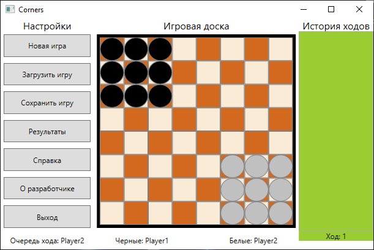
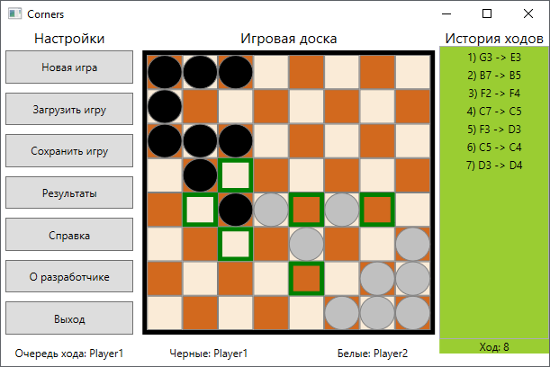
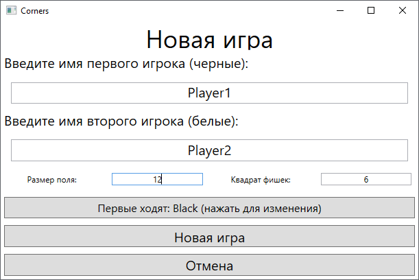
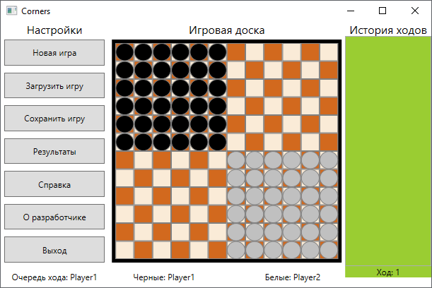
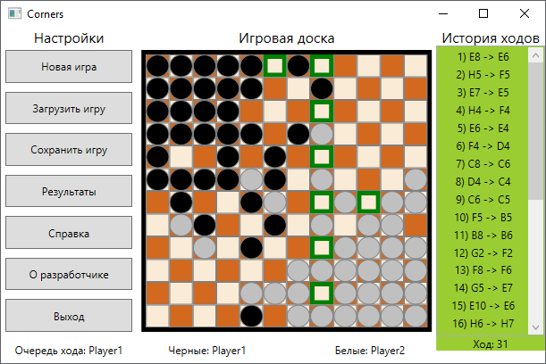

# Corners
Implementation of a famous board game in the ```C#``` programming language using Microsoft's ```WPF``` technology.
The application has the ability
- set custom field's size
- two players
- saving and loading game process
- display moves history
- table of records

## App starting view



## Code description
In project used the following technologies:
- .NET Framework 4.7.2
- WPF Framework (without MVVM)

## App examples

### Game example
Game has comfortable highlights, but selected checkers not have a highlight.



### Custom field
On new game creating player can set custom field's size. For following settings:



Field will look like:



Gaming example for custom big field:


